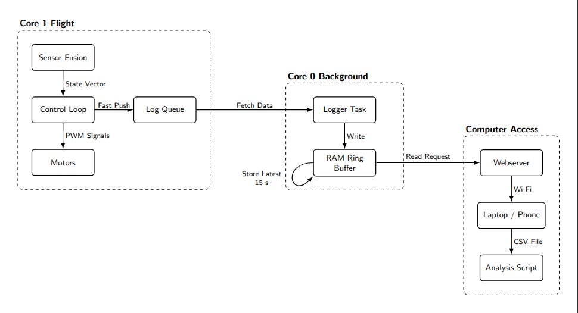

# QuadFC - ESP32 Based Flight Controller

A custom flight controller firmware built from scratch on ESP32. Inspired by Betaflight and ArduPilot, but designed for learning and experimentation.

---

## Demo


---

## About

This project started as a way to understand how drones actually work under the hood. Instead of using off-the-shelf flight controllers, I decided to build the firmware myself on an ESP32.

The goal was to replicate what Betaflight and ArduPilot do, but at a smaller and more accessible level. This isn't meant for commercial use - it's purely for learning, experimenting, and tinkering.

---

## Important Note on PID Values

This setup has **high mechanical gain** because of the 1400KV motors with 8045 props. That's why the PID values in this firmware are relatively low.

If you watch YouTube tutorials (like Joop Brokking or Carbon Aeronautics) where people use much higher PID values, it's because their mechanical gain is different (smaller props, lower KV motors, etc).

If you want easier tuning with lower mechanical gain:
- Use 1000KV motors
- Use 8045 props (8-inch)
- Same F450 frame

Also note: This firmware is written in **pure C** using the ESP-IDF framework, not Arduino C++.


---

## Features

- Cascaded PID control (outer angle loop + inner rate loop) running at 250Hz
- Self-leveling angle mode with automatic horizon correction
- Complementary filter for sensor fusion (gyro + accelerometer)
- One-time accelerometer calibration saved to flash memory
- Crash detection - auto disarms if the drone tilts too far or spins out of control
- RX failsafe - motors shut off if signal is lost
- Emergency stop button (BOOT button kills motors instantly)
- Low battery warning with LED indication
- PPM receiver input - works with FlySky and similar transmitters

**Note:** WiFi webserver and Blackbox logging are enabled by default. The webserver creates an access point called **'QuadPID'** (Password: `12345678`) for configuration at `http://192.168.4.1`. Blackbox logs flight data at ~83Hz for post-flight analysis.

To make the system more optimized (smaller firmware size, less CPU usage), you can disable the WiFi and Blackbox modules by commenting out the following in `src/main.c`:

1.  **Includes:** `blackbox.h` and `webserver.h`
2.  **Initialization:** `blackbox_init()` and `webserver_init()` (in `app_main`)
3.  **Logging Loop:** The entire `blackbox_log` if/else block (in `control_loop_task`)
4.  **Arming Logic:** `blackbox_start()`, `blackbox_stop()`, and `blackbox_clear()` calls

---


## Blackbox Logging for Systematic Tuning



I built the Blackbox logging system to make PID tuning **systematic and efficient**.

When tuning a drone, relying solely on visual observation ("it looks like it's wobbling") isn't enough. You need to know exactly what the flight controller is *thinking* versus what the drone is *doing*.

The Blackbox records high-frequency flight data, allowing me to see the noise, compare target vs. actual rates, and diagnose issues with data rather than guesswork. **This idea was taken from the "Black Box" (Flight Data Recorder) used in airplanes to analyze incidents.**

### Analyzing Data

You can visualize the flight performance using the included Python script. This plots the Target (Stick Input) vs Reality (Gyro) to help with PID tuning.

1.  Download the `blackbox.csv` from the Webserver (`http://192.168.4.1/blackbox`)
2.  Run the analyzer script:

```bash
python tools/log_analyzer.py blackbox.csv
```

**Try it out:** I've included a real flight log sample so you can see how it works:
```bash
python tools/log_analyzer.py assets/blackbox.csv
```

This will generate a flight logic overview graph showing:
1.  **Goal vs Reality:** How well the drone followed your stick commands.
2.  **PID Effort:** How hard the controller worked to correct errors.
3.  **Motor Output:** What the motors actually did.
4.  **Automated Diagnosis:** The script also performs basic health checks (vibration, oscillation, saturation) and prints a report.

*Note: This analyzer is a helper tool to point you in the right direction. It can detect obvious issues like heavy excessive vibration or severe oscillations, but fine-tuning still requires pilot judgement and patience!*

---

## Hardware Used

| Component | What I Used |
|-----------|-------------|
| Flight Controller | ESP32-WROOM-32 |
| IMU | MPU6050 |
| Frame | F450 |
| Motors | 1400KV Brushless |
| Propellers | 8045 |
| ESCs | 30A |
| Battery | 3S 2200mAh LiPo |
| Transmitter | FlySky FS-i6 |
| Receiver | FlySky FS-iA6B (PPM mode) |

---

## Wiring

```
ESP32 Pin    ->    Component
-----------------------------------
GPIO 13      ->    Motor 1 (Rear Right)
GPIO 27      ->    Motor 2 (Front Right)
GPIO 26      ->    Motor 3 (Rear Left)
GPIO 25      ->    Motor 4 (Front Left)
GPIO 33      ->    Receiver PPM Signal
GPIO 34      ->    Battery Voltage (via divider)
GPIO 21      ->    MPU6050 SDA
GPIO 22      ->    MPU6050 SCL
GPIO 2       ->    Status LED
GPIO 0       ->    BOOT Button
```

## Motor Layout

```
Motor positions (Quad-X, props-out):

   M4(CCW)──────M2(CW)      FRONT
       ╲      ╱
         ╲  ╱
         ╱  ╲
       ╱      ╲
   M3(CW)──────M1(CCW)      REAR

CCW = Counter-Clockwise
CW  = Clockwise
```

---

## How to Build and Flash

You'll need PlatformIO installed (VS Code extension works great).

```bash
# Build and upload
pio run --target upload

# Open serial monitor
pio device monitor
```

---

## Calibration

Before first flight, you need to calibrate the accelerometer:

1. Place the drone on a flat, level surface
2. Hold the BOOT button while powering on
3. Keep holding until the LED starts blinking
4. Release the button and wait for calibration to complete
5. Done - calibration is saved permanently

---

## How to Arm and Fly

1. Power on the drone and keep it still (gyro calibrates automatically)
2. Make sure throttle is at minimum
3. Flip the arm switch (Channel 5) to HIGH
4. LED turns solid - drone is armed
5. Slowly raise throttle and fly

To disarm, flip the arm switch back to LOW.

---

## System Architecture

```
                                  CONTROL LOOP (250Hz)

  INPUTS                            PROCESSING                           OUTPUTS
  ──────                            ──────────                           ───────

                             ┌─────────────────┐
  ┌─────────┐                │  COMPLEMENTARY  │
  │ MPU6050 │──Accel+Gyro───▶│     FILTER      │───Current Angle───┐
  │ (Sensor)│                └─────────────────┘                   │
  └────┬────┘                                                      ▼
       │                                                   ┌──────────────┐
       │                                                   │  ANGLE LOOP  │
       │                 ┌──────────────┐                  │     (PI)     │
       │                 │   RECEIVER   │───Roll Stick────▶│              │
       │                 │    (PPM)     │───Pitch Stick───▶│ Roll & Pitch │
       │                 │              │                  └──────┬───────┘
       │                 │  Channel 0   │                         │
       │                 │  Channel 1   │                   Target Rate
       │                 │  Channel 2   │                    (Roll/Pitch)
       │                 │  Channel 3   │                         │
       │                 └──────┬───────┘                         ▼
       │                        │                          ┌──────────────┐
       │   Gyro Rates           │                          │  RATE LOOP   │
       └────────────────────────┼─────────────────────────▶│    (PID)     │
                                │                          │              │
                                ├───Yaw Stick─────────────▶│ Roll         │
                                │   (direct to Rate Loop)  │ Pitch        │
                                │                          │ Yaw          │
                                │                          └──────┬───────┘
                                │                                 │
                                │                           Corrections
                                │                          (Roll/Pitch/Yaw)
                                │                                 │
                                │                                 ▼
                                │                          ┌──────────────┐      ┌────────┐
                                └───Throttle──────────────▶│    MIXER     │─────▶│ MOTORS │
                                    (direct to Mixer)      │   (Quad-X)   │      │M1 M2   │
                                                           └──────────────┘      │M3 M4   │
                                                                                 └────────┘
```

**Receiver Channels:**
| Channel | Stick | Goes To | Why |
|---------|-------|---------|-----|
| Ch 0 | Roll | Angle Loop → Rate Loop | Self-leveling (returns to level when stick released) |
| Ch 1 | Pitch | Angle Loop → Rate Loop | Self-leveling (returns to level when stick released) |
| Ch 2 | Throttle | Mixer directly | No control loop needed - direct power |
| Ch 3 | Yaw | Rate Loop directly | No heading hold (would need magnetometer) |

**Why Yaw bypasses Angle Loop:**
- **Roll & Pitch** need angle control for self-leveling (drone returns to level when you release sticks)
- **Yaw** only controls rotation speed, not a target heading angle
- To hold a specific yaw angle (heading), you'd need a magnetometer (compass) - not implemented

### Sensor Fusion: Complementary Filter

The IMU (MPU6050) has two sensors that measure orientation:

| Sensor | What it measures | Advantage | Disadvantage |
|--------|------------------|-----------|--------------|
| Accelerometer | Gravity direction | No drift, knows absolute "down" | Noisy, affected by vibrations |
| Gyroscope | Rotation rate | Fast, smooth, ignores vibrations | Drifts over time |

A **Complementary Filter** combines both to get the best of each:

```
new_angle = α × (old_angle + gyro × dt) + (1-α) × accel_angle
```

Where `α = 0.996` (99.6% gyro, 0.4% accelerometer)

- **Short-term (fast changes):** Trust gyroscope (smooth, responsive)
- **Long-term (slow corrections):** Trust accelerometer (prevents drift)

This gives us fast response without gyro drift - essential for stable flight.

---

## Safety Features

| What | When it triggers | What happens |
|------|------------------|--------------|
| Crash detection | Angle > 90° or Gyro > 2000°/s | Motors shut off |
| RX failsafe | No signal for 200ms | Motors shut off |
| Emergency stop | BOOT button pressed | Motors shut off immediately |
| Arm safety | Throttle not at zero | Won't arm |
| Low battery | Voltage < 10.5V | LED blinks warning |

---


---


---

## What's Next

Currently working on:
- Barometer-based altitude hold

Planned for future:
- GPS position hold
- Waypoint navigation
- Return to home

---

## Project Structure

```
QuadFC/
├── src/
│   └── main.c              # Main flight controller
├── lib/
│   ├── adc/                # Battery monitoring
│   ├── angle_control/      # Outer loop (Angle PI)
│   ├── blackbox/           # Flight data logging
│   ├── config/             # Settings & storage
│   ├── imu/                # MPU6050 & sensor fusion
│   ├── mixer/              # Motor mixing (Quad-X)
│   ├── pid/                # PID math
│   ├── pwm/                # ESC output
│   ├── rate_control/       # Inner loop (Rate PID)
│   ├── rx/                 # PPM receiver driver
│   └── webserver/          # WiFi AP & config server
├── tools/
│   └── log_analyzer.py     # Python script for blackbox analysis
├── assets/
│   ├── Blackbox_Blockdaigram.png
│   ├── QuadFc.gif
│   └── blackbox.csv        # Sample log file
├── platformio.ini
└── README.md
```

## Acknowledgments

Inspired by:
- [Betaflight](https://github.com/betaflight/betaflight)
- [ArduPilot](https://github.com/ArduPilot/ardupilot)
- [ESP-Drone](https://github.com/espressif/esp-drone)


---

## License

This project is for **educational and personal use only**.

You are free to:
- Learn from this code
- Modify it for personal projects
- Share it with proper credit

You are NOT allowed to:
- Use this in any commercial product
- Sell this code or products based on it

